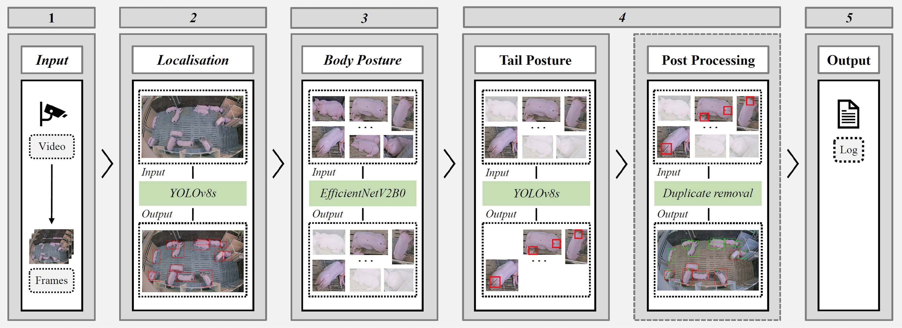

# Pig Monitoring Research

## Overview

This repository contains the code and associated materials for a series of publications on image-based monitoring techniques in pig farming. The projects aim to leverage image processing and machine learning to improve monitoring practices for pig behavior and welfare. Included works are:

- [Image-based Activity Monitoring of Pigs](https://www.researchgate.net/publication/378804050_Image-based_activity_monitoring_of_pigs)
- [Image-based Tail Posture Monitoring of Pigs](https://www.researchgate.net/publication/374156938_Image-based_Tail_Posture_Monitoring_of_Pigs)
- [Tail Posture as a Predictor of Tail Biting in Pigs: A Camera-Based Monitoring System](https://www.researchgate.net/publication/384687640_Tail_Posture_as_a_Predictor_of_Tail_Biting_in_Pigs_A_Camera-Based_Monitoring_System)

The repository includes:
- **Monitoring Pipeline**: Real-time detection and analysis of pig behavior
- **Comprehensive Analysis Framework**: Statistical analysis of tail posture patterns and activity behaviors
- **Early Warning System**: Threshold-based prediction system for tail biting outbreaks
- **Datasets and Models**: Links to trained models and annotated datasets
- **Visualization Tools**: Publication-quality plots and interactive visualizations

For details on data usage and restrictions, see the [License](#license) section. For a detailed description of the datasets, refer to the [Datasets](#datasets) section. Additionally, check out the [data exploration](data_exploration) directory and [analysis framework](#analysis-framework) for more details.

The results in this repository were developed as part of the [DigiSchwein](https://www.lwk-niedersachsen.de/lwk/news/35309_DigiSchwein) project. Check out the [Acknowledgements](#acknowledgements) section for more details.

## Tail Posture Monitoring Pipeline

Below is the visualization of the Tail Posture Monitoring Pipeline:



## Analysis Framework

The repository includes a comprehensive analysis framework for studying pig behavior patterns, particularly focused on tail posture changes before tail biting outbreaks. The framework supports:

### Core Analysis Modules

#### 1. **Tail Posture Analysis** (`evaluation/analysis/tail_posture_analysis/`)
- **Pre-outbreak Pattern Analysis**: Statistical analysis of tail posture changes leading up to culprit removal
- **Control Comparison**: Statistical comparison between outbreak and control pens
- **Individual Variation Analysis**: Pattern categorization of different outbreak trajectories
- **Component Analysis**: Decomposition of posture differences into upright vs hanging tail components

#### 2. **Activity Analysis** (`evaluation/analysis/activity_analysis/`)
- **Lying Behavior Analysis**: Analysis of pig lying patterns and activity metrics
- **Multi-metric Analysis**: Support for `num_pigs_lying`, `num_pigs_notLying`, and `activity` metrics
- **Component Relationship Analysis**: Understanding the relationship between lying and not-lying behaviors

#### 3. **Early Warning Analysis** (`evaluation/analysis/early_warning_analysis/`)
- **Threshold-based Prediction**: Multi-level threshold system (attention, alert, critical)
- **Performance Evaluation**: Statistical evaluation with sensitivity, specificity, precision, F1-score
- **Time-to-warning Analysis**: Analysis of warning timing before outbreaks
- **Individual Pen Visualization**: Timeline visualizations with threshold overlays

### Key Features

- **Publication-Quality Visualizations**: Dissertation-quality plots with consistent styling
- **Comprehensive Statistical Analysis**: Non-parametric tests, effect size calculations, confidence intervals
- **Quality Filtering**: Configurable thresholds for data quality assessment
- **Flexible Processing Pipeline**: Support for different resampling frequencies, smoothing methods, and interpolation techniques
- **Configuration Management**: JSON-based configuration system for reproducible analysis

### Usage Example

```python
from evaluation.analysis.tail_posture_analysis.tail_posture_analyzer import TailPostureAnalyzer
from evaluation.analysis.tail_posture_analysis.tail_posture_visualization import TailPostureVisualizer

# Load configuration
config = load_json_data('evaluation/configs/config_tail_posture.json')

# Initialize analyzer
analyzer = TailPostureAnalyzer(config)

# Run complete analysis
analyzer.load_data()
analyzer.preprocess_monitoring_results()
analyzer.analyze_pre_outbreak_statistics()
analyzer.analyze_control_pen_statistics()
analyzer.compare_outbreak_vs_control_statistics()
analyzer.analyze_individual_outbreak_variation()
analyzer.analyze_posture_components()

# Generate visualizations
visualizer = TailPostureVisualizer(config)
visualizer.visualize_pre_outbreak_patterns()
visualizer.visualize_comparison_with_controls()
visualizer.visualize_individual_variation()
visualizer.visualize_posture_components()
visualizer.visualize_data_completeness()

# Generate summary report
analyzer.generate_summary_report()
```

For detailed documentation of the analysis framework, see [`evaluation/analysis/README.md`](evaluation/analysis/README.md).

## Prerequisites

- Python 3.6 or higher
- Git
- FFmpeg

## Setup

This section guides you through setting up the project environment, including downloading the necessary models and data files.

### 1. Clone the Repository

First, clone this repository:

```bash
git clone https://github.com/jahewite/PigMonitoringResearch.git
```

### 2. Install dependencies

After cloning the repository, navigate into the project directory and install the project dependencies:

```bash
cd PigMonitoringResearch

# recommended: create venv
python3 -m venv *env_name*
# activate env
source *env_name*/bin/activate

# install packages
pip install -r requirements.txt
```

### 3. Download necessary files

- **Models**: Download the model files from [here](https://cloudstorage.uni-oldenburg.de/s/TA9zWsLc3Hby5Pp).
  - Place the **posture_classification.pth** file in the 'assets/models/classification/posture_classification/efficientnetv2' directory.
  - Place the **pig_detection.pt** file in the 'assets/models/detection/pig_detection/yolo/pig_detection.pt' directory.
  - Place the **tail_posture_detection.pt** file in the 'assets/models/detection/tail_detection/yolo/tail_posture_detection.pt' directory.
- **Test video clip**: Download the test video clip from [here](https://cloudstorage.uni-oldenburg.de/s/LWP4xM6RKxjakem) and place it in the 'assets/test_clips' directory.
- **Pipeline result files**: Download the .csv files containing the pipeline results for each analyzed pen from [here](https://cloudstorage.uni-oldenburg.de/s/a9B9QgYxqx6zFwf) and place them in the 'pipeline_outputs/monitoring_pipeline/piglet_rearing' directory.

### (Optional) Installing FFmpeg

This project requires FFmpeg for video processing capabilities. Please follow the instructions below to install FFmpeg on your system:

#### Windows
1. Download the FFmpeg build from https://ffmpeg.org/download.html.
2. Extract the files to a location on your computer.
3. Add the path to the FFmpeg bin folder (e.g., `C:\path\to\ffmpeg\bin`) to your system's Environment Variables under `Path`.

#### macOS
Use Homebrew to install FFmpeg:
```bash
brew install ffmpeg
```

#### Linux
Use apt-get to install FFmpeg:
```bash
sudo apt-get update
sudo apt-get install ffmpeg
```

## Example Usage

**Disclaimer:**
This is research in progress. When applying the pipeline to your own image data, it may happen that the detections do not function optimally. In this case, it would be sensible to fine-tune the existing models to the new data by adding new annotated data to the dataset. The code is also not optimized, which can lead to varying execution times when it is used.

### Pipeline Testing

To test the detection pipeline on a single image, take a look at the [inference_on_single_image.ipynb](data_exploration/inference_on_single_image.ipynb). You can also use the equivalent [inference_on_single_image.py](pipeline/utils/inference_on_single_image.py) to test it from the command line.

If downloaded, use the test clip for example usage. From the root directory, execute the following command:
```bash
python3 -m pipeline.analyze_video --path_to_videos assets/test_clips/test_1.mp4
```

### Analysis Framework Usage

For comprehensive analysis of monitoring results:

1. **Configure Analysis Parameters**: Edit the configuration files in `evaluation/configs/` to match your analysis requirements.

2. **Run Tail Posture Analysis**:
```bash
python3 -m evaluation.analysis.tail_posture_analysis.tail_posture_analyzer
```

3. **Run Activity Analysis**:
```bash
python3 -m evaluation.analysis.activity_analysis.pig_activity_analyzer
```

4. **Evaluate Early Warning System**:
```bash
python3 -m evaluation.analysis.early_warning_analysis.early_warning_analysis
```

All analyses generate comprehensive reports, statistical summaries, and publication-quality visualizations in the configured output directory.

## Datasets

This project includes all the datasets used in the research papers. The data can be downloaded [here](https://cloudstorage.uni-oldenburg.de/s/jsWLxmC6tCEnWNF).

### Data sources

The datasets include many different data sources. It contains images from:
- **Psota et al.**: [Multi-Pig Part Detection and Association with a Fully-Convolutional Network](https://www.mdpi.com/1424-8220/19/4/852)
- **Alameer et al.**: [Automated recognition of postures and drinking behaviour for the detection of compromised health in pigs](https://www.nature.com/articles/s41598-020-70688-6#data-availability)
- **Riekert et al.**: [Automatically detecting pig position and posture by 2D camera imaging and deep learning](https://www.sciencedirect.com/science/article/pii/S0168169918318283)
- **InnoPig project**: Funded by the Federal Ministry of Food and Agriculture (BMEL), grant number: 2817205413
- **KoVeSch project**: Funded by the Federal Office for Agriculture and Food (BLE), grant number: 2819109817

### Pig detection dataset

- Format: YOLO
- Contents: Contains 9.281 images annotated with the class 'Pig'.
- Purpose: Detection and localization of pigs in images. Baseline for subsequent pig posture and tail posture detections.

### Posture classification dataset

- Format: Standard image classification format
- Contents: Comprises 90.048 images classified into 'lying' and 'notLying'.
- Purpose: Classification of cropped pig detection images into 'lying' and 'notLying'

### Tail posture detection datasets

There are two datasets focused on the detection of pig tail postures, annotated with the classes 'upright' and 'hanging':

1. **Full Image Dataset**:
   - Format: YOLO
   - Contents: Includes 1.856 images where 'upright' and 'hanging' tail postures are annotated directly on the input images.
   - Purpose: 'upright' and 'hanging' tail posture detection on unaltered images.

2. **Cropped Pig Detections Dataset**:
   - Format: YOLO
   - Contents: Features 18.269 images of cropped pig detections, annotated for 'upright' and 'hanging' tail posture. These crops are derived using the pig detection model.
   - Purpose: Enhances the focus on tail postures by using cropped images that highlight the area of interest.
   - Additional Information: For detailed insights into the methodology behind cropped pig detections and tail posture annotation, refer to the research papers.

## Project Structure

```
PigMonitoringResearch/
├── assets/                          # Models, test clips, and figures
├── data_exploration/                # Jupyter notebooks for data exploration
├── evaluation/                      # Analysis framework
│   ├── analysis/                    # Core analysis modules
│   │   ├── tail_posture_analysis/   # Tail posture pattern analysis
│   │   ├── activity_analysis/       # Activity and lying behavior analysis
│   │   └── early_warning_analysis/  # Early warning system evaluation
│   ├── configs/                     # Configuration files
│   └── utils/                       # Shared utilities
├── pipeline/                        # Detection and monitoring pipeline
├── pipeline_outputs/                # Results from monitoring pipeline
└── requirements.txt                 # Python dependencies
```

## License

This project is licensed under multiple licenses:

- The code is licensed under the GNU Affero General Public License version 3 (AGPL-3.0), as found in the [LICENSE_CODE.txt](./LICENSE_CODE.txt) file.
- The dataset provided in this project is licensed under the Creative Commons Attribution-NonCommercial (CC BY-NC) license, as detailed in the [LICENSE_DATA](./LICENSE_DATA.txt) file.

## Acknowledgements

The project is supported (was supported) by funds of the Federal Ministry of Food and Agriculture (BMEL) based on a decision of the Parliament of the Federal Republic of Germany. The Federal Office for Agriculture and Food (BLE) provides (provided) coordinating support for digitalization in agriculture as funding organization, grant number 28DE109A18.

## Disclaimer on AI Assistance

Parts of the code and documentation in this project were created or improved with the assistance of generative AI tools (such as GitHub Copilot and large language models). All outputs were reviewed and adapted accordingly.


## Contact

For questions about this research or collaboration opportunities, please contact jan-hendrik.witte@uni-oldenburg.de.
